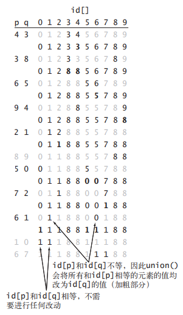
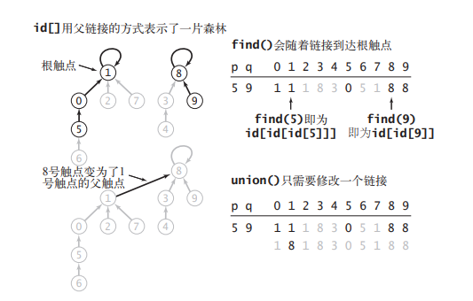
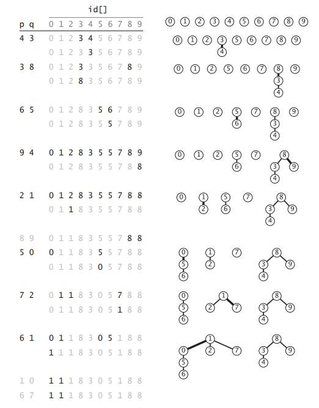
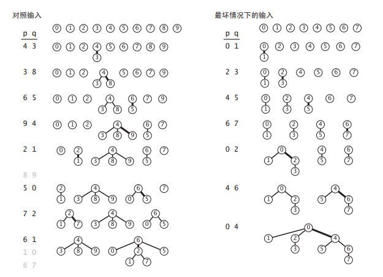

# union-find 算法

问题的输入是一列整数对，其中每个整数都表示一个某种类型的对象，一对整数 p q 可以被理解为「p 和 q 是相连的」 。

假设「相连」是 一种等价关系，这也就意味着它具有：

- 自反性：p 和 p 是相连的。
- 对称性：如果 p 和 q 是相连的，那么 q 和 p 也是相连的。
- 传递性：如果 p 和 q 是相连的且 q 和 r 是相连的， 那么 p 和 r 也是相连的。

目标是编写一个程序来过滤掉序列中所有无意义的整数对。

换句话说，当程序从输入中读取了整数对 p q 时，如果已知的所有整数对都不能说明 p 和 q 是相连的，那么则将这一对整数写入到输出中。如果已知的数据可以说明 p 和 q 是相连的，那么程序应该忽略 p q 这对整数并继续处理输入中的下一对整数。


**动态连通性问题的应用**：

- 网络

  输入中的整数表示的可能是一个大型计算机网络中的计算机，而整数对则表示网络中的连接。 这个程序能够判定我们是否需要在 p 和 q 之间架设一条新的连接才能进行通信，或是我们可以通过已有的连接在两者之间建立通信线路；或者这些整数表示的可能是社交网络中的人，而整数对表示的是朋友关系。

- 变量名等价性

  某些编程环境允许声明两个等价的变量名（指向同一个对象的多个引用）。在一系列这样的声明之后，系统需要能够判别两个给定的变量名是否等价。

- 数学集合

  在更高的抽象层次上，可以将输入的所有整数看做属于不同的数学集合。在处理一个整数对 p q 时，我们是在判断它们是否属于相同的集合。如果不是，我们会将 p 所属的集合和 q 所属的集合归并到同一个集合。

## API

现在使用网络方面的术语，将对象称为**触点**，将整数对称为**连接**，将等价类称为**连通分量**或是简称**分量**。

```java
public class UF {
    // 构造方法，以整数标识 [0, N - 1] 初始化 N 个触点
    UF(int N);

    // 在 p 和 q 之间添加一条连接
    void union(int p, int q);

    // p 所在的分量的标识符
    int find(int p);

    // 如果 p 和 q 存在于同一个分量中则返回 true
    boolean connected(int p, int q);

    // 连通分量的数量
    int count();    
}
```

如果两个触点在不同的分量中，`union()` 操作会将两个分量归并。

`find()` 操作会返回给定触点所在的连通分量的标识符。

`connected()` 操作能够判断两个触点是否存在于同一个分量之中。

`count()` 方法会返回所有连通分量的数量。一开始我们有 N 个分量，将两个分量归并的每次 `union()` 操作都会使分量总数减一。


为解决动态连通性问题设计算法的任务转化为了实现这份 API。所有的实现都应该：

- 定义一种数据结构表示已知的连接。
- 基于此数据结构实现高效的 `union()`、`find()`、`connected()` 和 `count()` 方法。


触点和分量都会用 int 值表示，所以可以用一个以触点为索引的数组 `id[]` 作为基本数据结构来表示所有分量。即 i 代表触点( 0 <= i < N)，`id[i]` 代表分量。

除了数组以外，再维护一个实例变量 count，`count()` 方法直接返回 count 即可。

`connected()` 方法的实现只需返回 `find(p) == find(q)` 即可，不用关心 `find()` 的具体实现。

所以具体的实现逻辑就在于 `find()` 和 `union()` 方法。

## quick-find

保证当且仅当 `id[p]` 等于 `id[q]` 时 p 和 q 是连通的。

即在同一个连通分量中的所有触点在 `id[]` 中的值必须全部相同。

```java
public class QuickFindUF {
    private final int[] id;
    private int count;

    public QuickFindUF(int N) {
        this.count = N;
        this.id = new int[N];
        for (int i = 0; i < N; i++) {
            this.id[i] = i;
        }
    }

    public boolean connected(int p, int q) {
        return find(p) == find(q);
    }

    public int count() {
        return count;
    }

    public int find(int p) {
        return id[p];
    }

    public void union(int p, int q) {
        int pID = find(p);
        int qID = find(q);
        if (pID == qID) {
            return;
        }
        for (int i = 0; i < id.length; i++) {
            if (id[i] == pID) {
                id[i] = qID;
            }
        }
        count--;
    }
}
```

quick-find 的轨迹:



### 分析

`find()` 操作的速度显然是很快的，因为它只需要访问 `id[]` 数组一次。对于每一对输入 `union()` 都可能需要扫描整个 `id[]` 数组。`union()` 操作访问数组的次数在 `N+3` 到 `2N+1` 之间。

如果最后只得到了一个连通分量，那么至少需要调用 N-1 次 `union()`，即至少 `(N+3)(N-1) ～ N^2` 次数组访问。

可见算法时间效率是平方级别的。

## quick-union

改变 `id[i]` 的含义，每个触点所对应的 `id[]` 元素都是同一个分量中的另一个触点的名称，也可能就是自身。如果 `i == id[i]`，即为根触点。

在实现 `find()` 方法时，从给定的触点开始，由它的链接得到另一个触点，再由这个触点的链接到达第三个触点，如此继续跟随着链接直到到达一个根触点。

`union()` 中只需要修改一次「链接」即可。



```java
public class QuickUnionUF {
    private final int[] id;
    private int count;

    public QuickUnionUF(int N) {
        this.count = N;
        this.id = new int[N];
        for (int i = 0; i < N; i++) {
            this.id[i] = i;
        }
    }

    public boolean connected(int p, int q) {
        return find(p) == find(q);
    }

    public int count() {
        return count;
    }

    public int find(int p) {
        while (p != id[p]) {
            p = id[p];
        }
        return p;
    }

    public void union(int p, int q) {
        int pRoot = find(p);
        int qRoot = find(q);
        if (pRoot == qRoot) {
            return;
        }
        id[pRoot] = qRoot;
        count--;
    }
}
```

quick-union 的轨迹：



### 分析

`id[]` 数组用父链接的形式表示了一片森林，一个森林就代表一个连通分量。

`find()` 方法访问数组的次数为 1 加上给定触点所对应的节点的深度的两倍。`union()` 和 `connected()` 访问数组的次数为两次 `find()` 操作(`union()`可能为三次)。

同样如果最后只得到一个连通分量，算法的运行时间在最坏情况下仍是平方级别的。

对于整数对 0 - i，`union()` 操作访问数组的次数为 `2i+1` (触点 0 的深度为 i-1，触点 i 的深度为 0)。 

因此，处理 N 对整数所需的所有 `find()` 操作访问数组的总次数为 `3+5+7+…+(2N-1) ～ N^2`。

## 加权 quick-union

与其在 `union()` 中随意将一棵树连接到另一棵树，现在记录每一棵树的大小并总是选择将较小的树连接到较大的树上。

```java
public class WeightedQuickUnionUF {
    private final int[] id;
    private final int[] sz; // 由触点索引的各个根节点所对应的分量的大小
    private int count;

    public WeightedQuickUnionUF(int N) {
        this.count = N;
        this.id = new int[N];
        this.sz = new int[N];
        for (int i = 0; i < N; i++) {
            this.id[i] = i;
            this.sz[i] = 1;
        }
    }

    public int count() {
        return count;
    }

    public boolean connected(int p, int q) {
        return find(p) == find(q);
    }

    public int find(int p) {
        while (p != id[p]) {
            p = id[p];
        }
        return p;
    }

    public void union(int p, int q) {
        int i = find(p);
        int j = find(q);
        if (i == j) {
            return;
        }
        // 将小树的根节点连接到大树的根节点
        if (sz[i] < sz[j]) {
            id[i] = j;
            sz[j] += sz[i];
        } else {
            id[j] = i;
            sz[i] += sz[j];
        }
        count--;
    }
}
```

加权 quick-union 的轨迹:



### 分析

最坏情况下，将要被归并的树的大小总是相等的(且总是 2 的幂)。这些树均含有 2n 个节点，因此高度都正好是 n。当归并两个含有 2n 个节点的树时，得到的树含有 2n+1 个节点，由此将树的高度增加到了 n+1。可见能保证对数级别的效率。

对于 N 个触点，加权 quick-union 算法构造的森林中的任意节点的深度最多为 lgN。

## 使用路径压缩的加权 quick-union

理想情况下，肯定希望每个节点都直接链接到它的根节点上，但又不想像 quick-find 算法那样通过修改大量链接做到这一点，可以在检查节点的同时将它们直接链接到根节点。

要实现路径压缩，只需要为 `find()` 添加一个循环，将在路径上遇到的所有节点都直接链接到根节点。

```java
public class WeightedQuickUnionPathCompressionUF {
    private final int[] id;
    private final int[] size;
    private int count;

    public WeightedQuickUnionPathCompressionUF(int N) {
        this.count = N;
        this.id = new int[N];
        this.size = new int[N];
        for (int i = 0; i < N; i++) {
            this.id[i] = i;
            this.size[i] = 1;
        }
    }

    public int count() {
        return count;
    }

    public boolean connected(int p, int q) {
        return find(p) == find(q);
    }

    public int find(int p) {
        int root = p;
        // 找到跟节点
        while (root != id[root]) {
            root = id[root];
        }
        while (p != id[p]) {
            int temp = p;
            p = id[p];
            id[temp] = root;
        }
        return p;
    }

    public void union(int p, int q) {
        int i = find(p);
        int j = find(q);
        if (i == j) {
            return;
        }
        if (size[i] < size[j]) {
            id[i] = j;
            size[j] += size[i];
        } else {
            id[j] = i;
            size[i] += size[j];
        }
        count--;
    }
}
```

### 分析

路径压缩的加权 quick-union 算法是最优的算法，但并非所有操作都能在常数时间内完成。

<table>
   <tr>
      <th rowspan="2">算法</th>
      <th colspan="2">存在 N 个触点时成本的增长数量级(最坏情况下)</th>
   </tr>
   <tr>
      <th>union()</th>
      <th>find()</th>
   </tr>
   <tr>
      <td>quick-find</td>
      <td>N</td>
      <td>1</td>
   </tr>
   <tr>
      <td>quick-union</td>
      <td>树的高度</td>
      <td>树的高度</td>
   </tr>
   <tr>
      <td>加权 quick-union</td>
      <td>lgN</td>
      <td>lgN</td>
   </tr>
   <tr>
      <td>使用路径压缩的加权 quick-union</td>
      <td colspan="2">非常非常地接近但仍没有达到 1 (均摊成本)</td>
   </tr>
</table>

